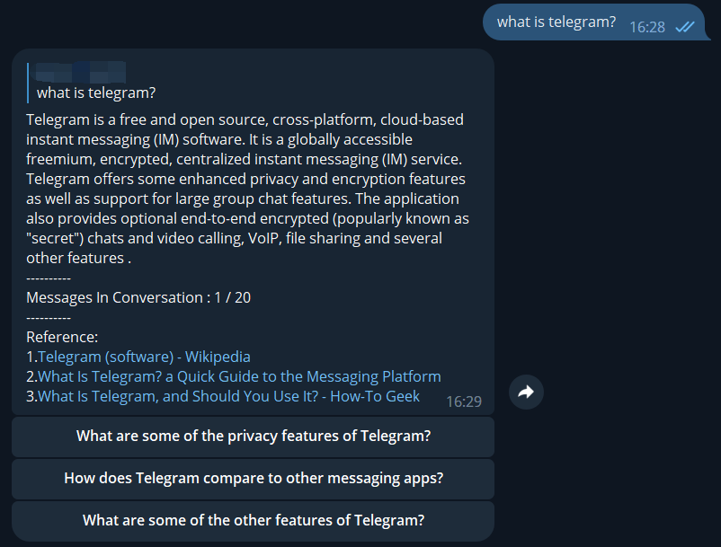

Language : English [简体中文](README.zh-cn.md)
# Description

Bing chat Telegram bot implemented in Python that utilizes unofficial [EdgeChat](https://github.com/acheong08/EdgeGPT) API

## Known issues

- ~~Different people will use the same conversation~~（fixed）

## Screenshot



## Command list

```
help - Show help message
reset - Reset conversation
switch - Switch conversation style ( creative , balanced , precise )
```

# Setup

## Requirements

- python 3.8+
- A Microsoft Account with early access to http://bing.com/chat (Required)

  ## Checking access (Required)

- Install the latest version of Microsoft Edge
- Open http://bing.com/chat
- If you see a chat feature, you are good to go

 ## Getting authentication (Required)

- Install the cookie editor extension for [Chrome and Edge](https://chrome.google.com/webstore/detail/cookie-editor/hlkenndednhfkekhgcdicdfddnkalmdm) or [Firefox](https://addons.mozilla.org/en-US/firefox/addon/cookie-editor/)
- Go to `bing.com`
- Open the extension
- Click "Export" on the bottom right (This saves your cookies to clipboard)
- Paste your cookies into a file `cookies.json`. The format of json refers to `cookie.exaple.json`(The middle field is omitted)

## Install requirements

```shell
pip install -r requirements.txt
```

## Set environment variables

### Required variable

```shell
export BOT_TOKEN='REPLACE YOUR BOT TOKEN'
export ALLOWED_USER_IDS='XXXXXXXXX,XXXXXXXX,XXXXXXXX'
```

### Optional variable

```shell
#Default value is './cookie.json'
export COOKIE_PATH='xxxxxx' 

#Default value is False , if you set True , Anyone can use the robot
export PUBLIC_MODE=False
```

:warning:Please set ALLOWED_USER_IDS even if PUBLIC_MODE is True , because only ALLOWED_USER_IDS can switch the conversation style 

If you want to add the bot to the group chat , please set these variables and  give the bot admin permission

```shell
export BOT_ID='@YOURBOTID' #DON'T forget @
export GROUP_MODE=False #Default value is False
```
If GROUP_MODE is True , The bot will reply to all messages in the group chat , else  the bot will only reply to @ messages in the group chat
Private chat will always reply

## Run

```shell
python bing.py 
```


