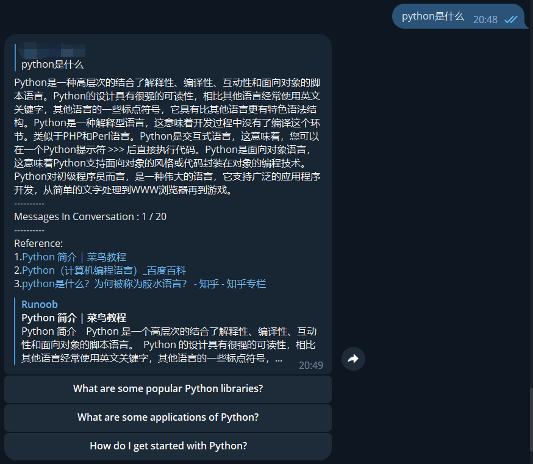

语言：[English](README.MD) 简体中文
# 介绍

使用非官方 [EdgeChat](https://github.com/acheong08/EdgeGPT) API 的 Python 实现的 Bing 聊天 Telegram 机器人

## 已知问题

- ~~不同用户会使用同一个对话~~（已修复）

## 截图



## 命令列表

```
help - 帮助信息
reset - 重置对话
switch - 切换对话风格 ( creative , balanced , precise )
```

# 安装

## 需求

- python 3.8+
- 一个能访问 http://bing.com/chat的微软账号 (必须！)

## 检查访问权限

- 安装最新版本的 Microsoft Edge
- 访问 http://bing.com/chat
- 如果你能看到聊天界面，说明你有访问权限

 ## 获取cookie

- 安装cookie插件：Chrome](https://chrome.google.com/webstore/detail/cookie-editor/hlkenndednhfkekhgcdicdfddnkalmdm) ， [Firefox](https://addons.mozilla.org/en-US/firefox/addon/cookie-editor/)
- 访问 http://bing.com/chat
- 打开插件
- 点击底部的Export按钮 (cookie将会复制到你的剪贴板)
- 粘贴你的cookie到 `cookies.json`. json的格式参见 `cookie.exaple.json`(中间部分省略)

## 安装依赖

```shell
pip install -r requirements.txt
```

## 设置环境变量

### 必须变量

```shell
export BOT_TOKEN='REPLACE YOUR BOT TOKEN'
export ALLOWED_USER_IDS='XXXXXXXXX,XXXXXXXX,XXXXXXXX'
```

### 可选变量

```shell
#默认值为 './cookie.json'
export COOKIE_PATH='xxxxxx' 

#默认值为 False , 如果你设置为True，任何人都可以使用bot
export PUBLIC_MODE=True


#如果你想将bot添加至群聊，请设置这些环境变量，并授予bot管理员权限
export BOT_ID='@YOURBOTID' #别忘了@
export GROUP_MODE=True #默认值为 False
```
如果  GROUP_MODE 为True ，bot将会回复群组里所有消息 , 否则bot只会回复@它的消息
私聊消息一直会回复

## 运行

```shell
python bing.py 
```


